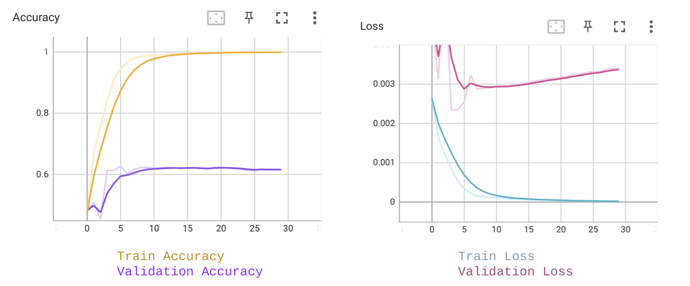

# Age Classifier <br/> 
## Classifier which estimates the age of humans built on PyTorch <br/> 

<br/>
<p align= "center">

</p>
<br/>

> - Predicted age of some famous stars. 
> - Input: Any size, type (extension) facial RGB image of a person. 
> - Output: Predicted Age Range
> - 70.3215 % accuracy achieved. 

## Environment Setups
> Note: This code was developed on Ubuntu 20.04 with Python 3.7. Later versions should work, but have not been tested.
Create and activate a virtual environment to work in, e.g. using Conda:

```
conda create -n venv_age python=3.7
conda activate venv_agep
```

> Install Pytorch according to your GPU verison. eg) RTX 3090, CUDA 11.0 
```
pip install torch==1.7.1+cu110 torchvision==0.8.2+cu110 torchaudio==0.7.2 -f https://download.pytorch.org/whl/torch_stable.html
```
> Not recommended but this project also works on CPU. Install Pytorch according to your OS. eg) Linux
```
conda install pytorch torchvision torchaudio cpuonly -c pytorch
```

>Install other dependencies. 
```
pip install -r requirements.txt
```

### Pretrained Model 
The pretrained model trained on Resnet50 can be found here: <br/>
<a href="https://drive.google.com/file/d/1w0ktgUwAhtyAaGTP2NZkZqOSpfEcWF3p/view?usp=share_link">best_checkpoint.pth</a>

### Dataset
This project uses the <a href="https://aihub.or.kr/aihubdata/data/view.do?currMenu=115&topMenu=100&aihubDataSe=realm&dataSetSn=528">Facial Image Data with Known Family Relationships</a> dataset from AI Hub. 

Download the dataset here: <br/>
<a href="https://drive.google.com/file/d/1YOfavMsYwv21IQ19iDN3THppfhx4cM3n/view?usp=share_link"> Dataset</a>

### Folder Hierarchy
Once you sucessfully downloaded and unzips dataset files, you should have a directory similar to this:
   ```
    ./face_dataset
    ├── 
    │   └── fixed_test_val
    │   └── fixed_val_dataset
    |   └── test_images
    │   └── train_images
    │   └── val_images
    |   └── custom_test_dataset.csv
    |   └── custom_train_dataset.csv
    |   └── custom_val_dataset.csv
   ```
## Running the demo
To run the model:
```
python demo.py --input InputDirectory --output OutputDirectory --checkpoint checkpoints/best_checkpoint.pth
```
### Model options
```
  --input               STR     Input Directory
  --output              STR     Output Directory
  --checkpoint          STR     Model Checkpoint                                    
```
## Training 

To train and reproduce the results, run:
```
python main.py --num_epochs 15 --save_dir checkpoints/
```
This will automatically save the model with the highest accuracy into your designated output folder, in this case in ```checkpoints/best_checkpoint.pth```. There is a ```adjust_learning_rate``` function which I've added to allow the model to converge faster while preventing overfitting. If you want to train at a constant learning rate, please change the ```adjust_lr``` flag to ```False```.

### Model options
```
  --batch_size              INT         Batch Size
  --num_epochs              INT         Number of Epochs
  --learning_rate           FLOAT       Learning Rate    
  --momentum                FLOAT       Momentum
  --weight_decay            FLOAT       Weight Decay
  --num_workers             INT         Number of workers
  --log_interval            INT         Interval of Logs
  --save_interval           INT         Interval for saving
  --save_dir                STR         Output Directory
  --log_dir                 STR         Log Directory
  --adjust_lr               BOOL        Adjusting Learning Rate
```
### Tensorboard Logs
<br/>
<p align= "center">

</p>
<br/>

You can use tensorboard to visualize loss/accuracy plot with: 
```
tensorboard --logdir runs/
```
