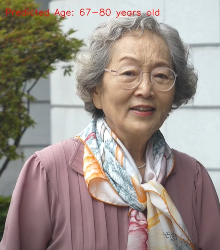
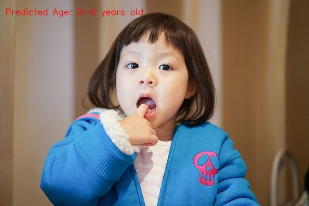

# Age Classification Model <br/> 
Model to estimate age trained on ResNet50<br/> 

<br/>
<p align= "center">

</p>
<br/>

<br/>
<p align= "center">

</p>
<br/>

> - Top: Input Images 
> - Bottom: Generated Panoramic Image


## Environment Setup
> Note: This code was developed on Ubuntu 20.04 with Python 3.7. Later versions should work, but have not been tested.
Create and activate a virtual environment to work in, e.g. using Conda:

```
conda create -n venv_age python=3.7
conda activate venv_age
```

> Install Pytorch according to your GPU verison. eg) RTX 3090, CUDA 11.0 
```
pip install torch==1.7.1+cu110 torchvision==0.8.2+cu110 torchaudio==0.7.2 -f https://download.pytorch.org/whl/torch_stable.html

```
>Install other dependencies. 
```
pip install -r requirements.txt
```

### Folder Hierarchy
Once you sucessfully downloaded and unzips dataset files, you should have a directory similar to this:
   ```
    ./dataset/
    ├── custom
    │   └── sample_data.csv
    │   └── test_1.csv
    |   └── test_2.csv
    │   └── test_3.csv
    ├── facebook_clean_data
    |   └──artist_edges.csv  
    |   └──athletes_edges.csv  
    |   └──company_edges.csv  
    |   └──government_edges.csv  
    └── git_web_ml
        └── musae_git_edges.csv
   ```
## Running the demo
To run inference on the pretrained model, run:
```
python demo.py
```
#### Model options
```
  --input               STR    Input graph path.                                    
```
> - To use your own set of images, place your images in the ```input``` folder. <br/>
> - Update your camera parameters ```K``` in the ```demo.py``` file. Accurate camera parameters are needed to produce robust results. 
> - Each step is printed when an input image has been transformed and projected on to the new image plane. 


